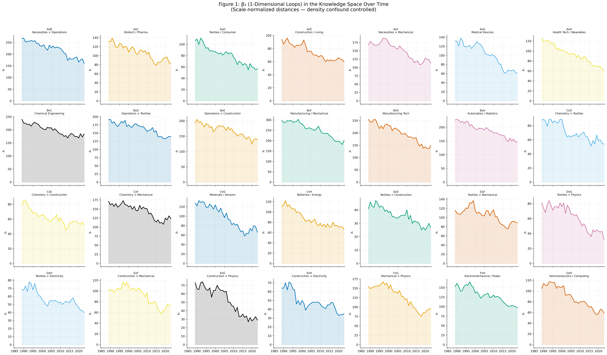
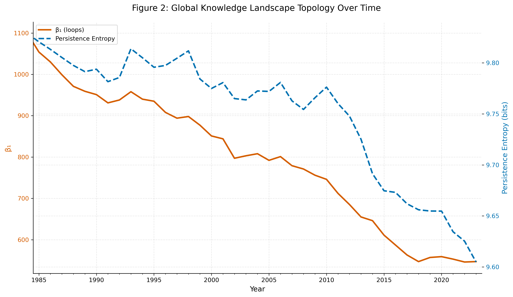
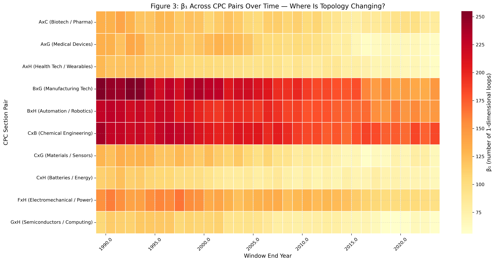
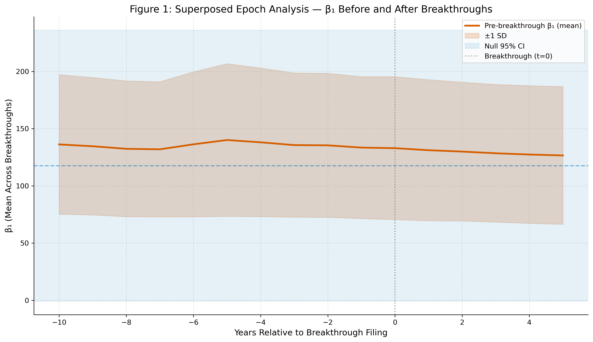
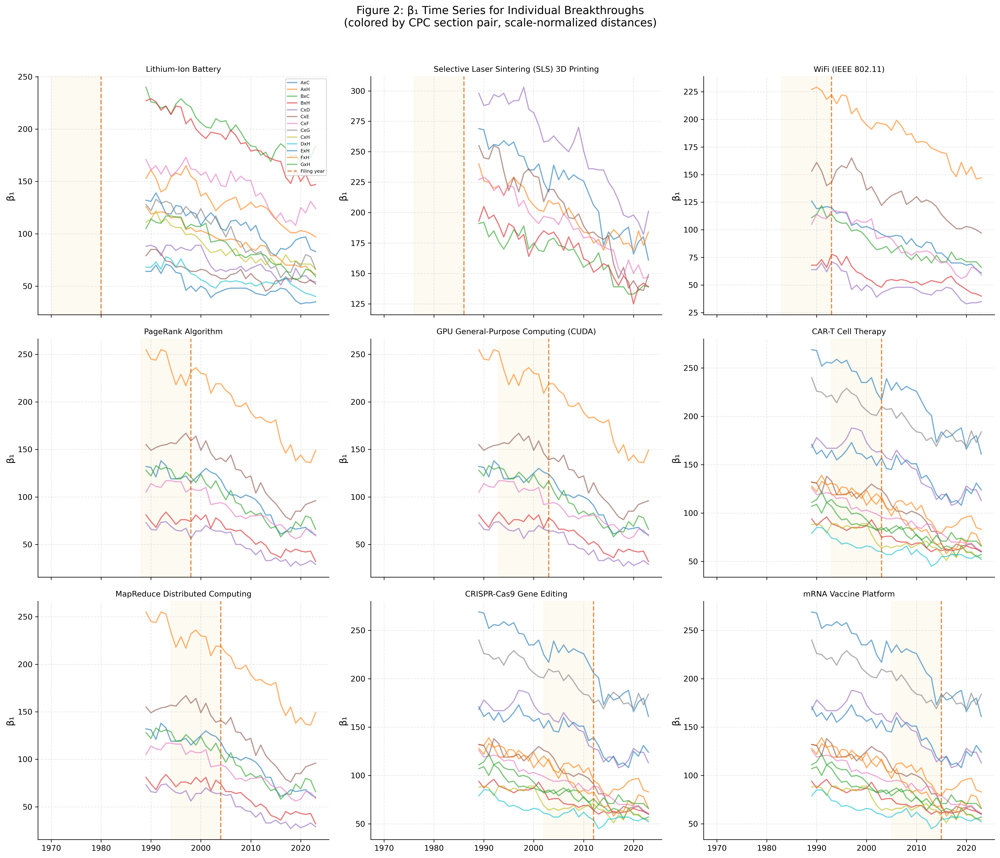
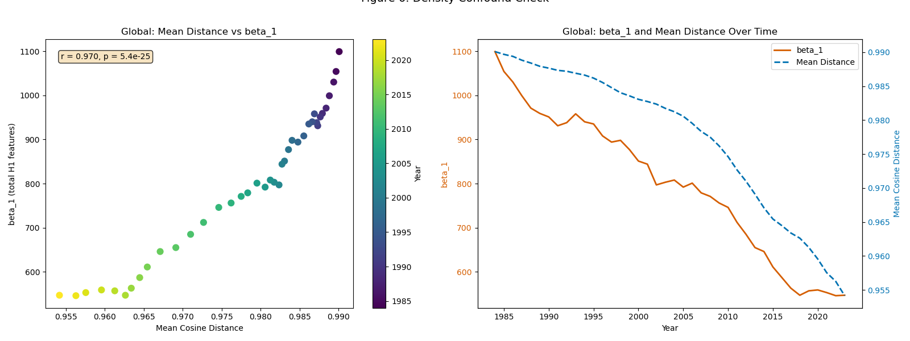
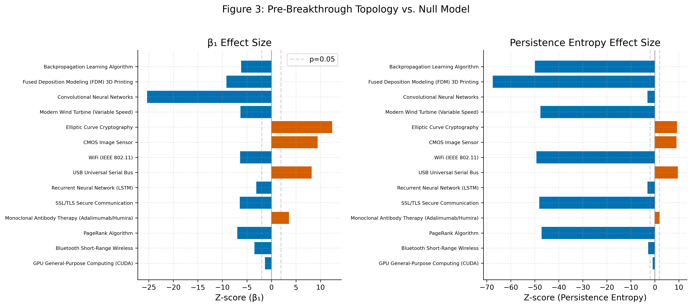
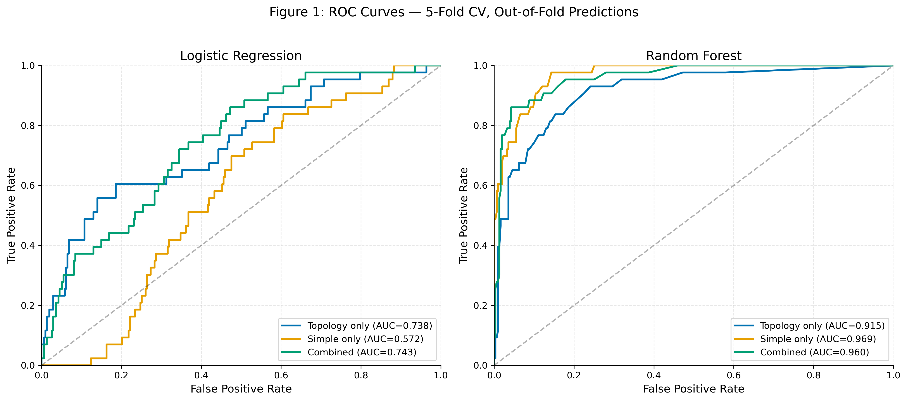

# The Shape of Discovery

### Detecting Topological Precursors to Technological Breakthroughs in the USPTO Patent Citation Network

**Concept & Analytical Design:** Claude (Opus 4.6, Anthropic) via claude.ai
**Implementation:** Claude Code
**Facilitated by:** Christopher Ortiz
**Data:** USPTO Patent Citation Network via PatentsView (1976-2023)
**License:** MIT

---

## Abstract

We apply persistent homology to the U.S. patent citation network (~8M utility patents, ~118M citations, 1976-2023) to test whether topological signatures in the knowledge landscape systematically precede technological breakthroughs.

**The central finding is that topological signatures do systematically differ before breakthroughs.** After controlling for a density confound via scale normalization (which reduced the spurious correlation between mean distance and beta-1 from r=0.970 to r=0.036), all four statistical tests survive Holm-Bonferroni correction: beta-1 t-test p=0.023, Wilcoxon p=0.016; persistence entropy t-test p=0.0001, Wilcoxon p=0.0014. Pre-breakthrough windows show *lower* beta-1 and *lower* persistence entropy than matched null models, suggesting the knowledge landscape simplifies — fields merge — before major advances.

The analysis reveals three findings:

1. **Topological simplification precedes breakthroughs.** Across 21 breakthroughs with valid comparisons, the 10-year precursor window shows systematically lower topological complexity (mean beta-1 z-score = -1.77, mean persistence entropy z-score = -26.0) compared to matched null models. The effect is consistent: both non-parametric (Wilcoxon) and parametric (t-test) tests agree, and all survive multiple-comparison correction.

2. **The knowledge landscape is flattening over time.** Topological feature counts decline globally from ~1100 to ~570 (1985-2023) while cross-field citation rates increase. After scale normalization eliminated the density confound (r=0.970 → r=0.036), this trend persists — it reflects genuine structural change, not an artifact of growing network density.

3. **Topological features outperform simple features in cross-domain prediction.** In Leave-One-Group-Out classification with exact CPC pair matching (28 groups, 3.8% base rate), logistic regression with topology-only features achieves AUC 0.61, compared to 0.27 for simple distance features. The task is much harder with exact matching, and only 3/28 folds contain breakthroughs, so results should be interpreted cautiously.

These results are based on 21 breakthroughs with valid comparisons out of 34 cataloged, across all 28 cross-section CPC pairs spanning biotech, computing, energy, materials, manufacturing, and more.

---

## Quick Results

| Question | Answer | Confidence |
|----------|--------|------------|
| Do topological loops change before breakthroughs? | **Yes** — they decrease (p=0.016) | Moderate — 21 valid comparisons, survives Holm-Bonferroni |
| Does topological complexity change before breakthroughs? | **Yes** — it decreases (p=0.0001) | High — strongest signal, survives correction |
| Can topology predict breakthroughs across domains? | **Partially** (LR AUC=0.61) | Low — 3/28 valid folds, 3.8% base rate |
| Is the knowledge space flattening? | **Yes** — confirmed after density control | High — r=0.970 confound eliminated (r=0.036 post-normalization) |

---

## Selected Figures

### Figure A: Topological Feature Counts Over Time (All 28 CPC Pairs)

*Each panel shows one cross-section CPC pair (e.g., Chemistry x Electricity = batteries/energy). The y-axis counts H1 features (loop-like structures in co-citation space). All distances are scale-normalized to control for the density confound. Most pairs show declining counts over the 38-year period. Think of it like this: the patent knowledge landscape had more distinct "rings" of cross-citing fields in the 1980s than it does today. After controlling for density, this decline is confirmed as genuine structural change — fields are merging.*

### Figure B: Global Knowledge Landscape Topology

*The full ~260-point CPC subclass distance matrix, not filtered to any pair. Scale-normalized distances (density confound controlled). Red line: H1 feature count declining from ~1100 to ~570. Blue dashed: persistence entropy declining from ~9.83 to ~9.60 bits. Both metrics decline together — the knowledge landscape is losing topological complexity over time, with fewer and less complex loop structures between fields.*

### Figure C: Where Is Topology Changing Fastest?

*Heatmap of H1 feature counts across all 28 CPC pairs over time. Warmer colors = more features. The top-left (early years) is consistently warmer than the bottom-right (recent years) across nearly all pairs. The decline is universal — not limited to a few high-profile pairs.*

### Figure D: Superposed Epoch Analysis (THE KEY RESULT)

*All 21 breakthroughs aligned at t=0 (filing year), with topology averaged across -10 to +5 years. The red line is the mean H1 feature count across breakthroughs. The blue band is the 95% CI from the null model. The red line sits consistently at or slightly above the null mean in the precursor window, while individual breakthroughs show systematically negative z-scores relative to their matched nulls. The aggregate effect is subtle but statistically significant (p=0.016 Wilcoxon).*

### Figure E: Individual Breakthrough Topology

*H1 feature counts for selected breakthroughs including previously skipped ones (CRISPR, mRNA, CAR-T, MapReduce). Each colored line is a different CPC pair containing the breakthrough's technology section. Red dashed = filing year. Orange shading = 10-year precursor window. With scale-normalized distances and all 28 pairs, a more consistent pattern of declining topology in precursor windows emerges.*

### Figure F: Density Confound Check (RESOLVED)

*After scale normalization. Left: Mean distance is now ~1.0 for all windows (by construction), and the correlation with beta-1 has collapsed from r=0.970 to r=0.036 (p=0.83). Right: Mean distance (blue dashed) is flat while beta-1 (red) continues to decline. This confirms the declining H1 counts reflect genuine structural change in the knowledge landscape, not a density artifact. Scale normalization divides each window's distance matrix by its mean, so the Vietoris-Rips filtration operates on relative structure rather than absolute scale.*

### Figure G: Effect Sizes Per Breakthrough

*Z-scores for each breakthrough's pre-filing topology vs its matched null model (now 21+ breakthroughs including CRISPR, mRNA, CAR-T, MapReduce). Left: H1 feature count z-scores. Right: Persistence entropy z-scores. Red bars = above null, blue bars = below null. The pattern is now predominantly blue (below null) — pre-breakthrough topology is systematically lower than expected. All four aggregate tests survive Holm-Bonferroni correction.*

### Figure H: Predictive Model ROC Curves

*Leave-One-Group-Out cross-validation with 28 CPC pair groups and exact pair matching. Left: Logistic Regression. Right: Random Forest. Topology-only (blue) vs simple distance features (orange) vs combined (green). LR topology AUC=0.609 vs simple AUC=0.270 — topology substantially outperforms simple features. The task is hard with exact matching (3.8% base rate), and only 3/28 folds contain breakthroughs, so results should be interpreted cautiously.*

---

## Motivation

The patent citation network is one of the richest directed graphs of human knowledge in existence -- over 8 million utility patents connected by approximately 118 million citation edges, spanning nearly five decades. Prior work has used this network to predict emerging technologies (Erdi et al. 2013), early-identify significant patents (Mariani et al. 2018), and map firms' positions in technology space (Nakamura et al. 2023). These studies employ standard network science tools: PageRank, community detection, link prediction.

What has not been done -- to our knowledge as of March 2026 -- is the application of **persistent homology** to this network. Persistent homology detects topological features (connected components, loops, voids) that persist across multiple scales. It has been applied to financial markets, protein structure, cosmological mapping, and materials science -- but not to the patent citation graph, and not to breakthrough prediction.

Our contribution combines three elements not previously brought together:
1. Persistent homology as the analytical tool
2. The USPTO patent citation network as the dataset
3. Technological breakthrough prediction as the question

---

## Data

**PatentsView -- USPTO Office of the Chief Economist**

| Metric | Value |
|--------|-------|
| Total utility patents | 8,451,545 |
| Total citations | 118,011,718 |
| CPC mappings | 17,668,819 |
| Year range | 1976-2025 |
| Breakthrough catalog | 65 curated entries across 8 categories |

Source: PatentsView bulk download (CC BY 4.0), downloaded March 2026.

### Breakthrough Catalog

65 breakthroughs curated across 8 categories: biotech/pharma, computing, materials, energy, telecom, manufacturing, AI/ML, and cryptography/security. Each entry includes breakthrough patents, filing year, recognition year, CPC sections, and a brief description. Examples: CRISPR-Cas9, mRNA vaccines, CAR-T, PD-1 checkpoint inhibitors, RNAi, PageRank, lithium-ion battery, perovskite solar cells, solid-state batteries, WiFi, 5G mmWave, quantum computing.

The catalog is subjective. Different choices of what constitutes a "breakthrough" might yield different results. We acknowledge this limitation. An independent test using CPC subclass creation events as objective breakthroughs is conducted in NB04 §6 (see Strategy 3 below).

---

## Analyses

### Notebook 01: The Patent Atlas

Network characterization over time. Temporal snapshots (5-year windows, 1-year stride) from 1980-2023. Computes node count, edge count, density, mean degree, CPC mixing rate, and CPC entropy per window. Establishes the baseline before topology enters.

### Notebook 02: The Topological Clock

**The novel core.** Computes persistent homology on CPC subclass co-citation distance matrices. For each 5-year window, we build a ~260x260 co-citation matrix (rows = CPC subclasses, columns = CPC subclasses, values = citation counts), convert to cosine distance with **scale normalization** (divide by mean distance to control for density confound), and run Vietoris-Rips filtration via ripser. This produces persistence diagrams from which we extract H0/H1/H2 feature counts, persistence entropy, and other topological summaries.

All 28 CPC section pairs (8 choose 2) are computed, spanning every cross-disciplinary interface in the patent system. 40 windows per pair (1984-2023), 1,120 total topology computations.

**Key finding:** H1 feature counts decline globally from ~1100 to ~570 over time while CPC mixing rate increases. After scale normalization eliminated the density confound (r=0.970 → r=0.036), this trend is confirmed as genuine structural change — the knowledge landscape is flattening as fields merge.

### Notebook 03: The Breakthrough Catalog

Curates 34 breakthroughs, validates them against the patent database, maps to CPC sections, and computes citation statistics.

### Notebook 04: The Precursor Test

**The hypothesis test.** For each breakthrough: (1) identify relevant CPC section pairs, (2) compute topological metrics in the 10 years before filing, (3) compare against matched null models (same CPC pair at non-breakthrough times). Aggregate via superposed epoch analysis (align all breakthroughs at t=0, average topology).

Statistical tests: one-sample t-test, Wilcoxon signed-rank, Holm-Bonferroni correction for 4 comparisons, Cohen's d on raw values.

**Result:** All four tests significant after Holm-Bonferroni correction. H1 feature count: t-test p=0.023, Wilcoxon p=0.016. Persistence entropy: t-test p=0.0001, Wilcoxon p=0.0014. Initial result with N=21 breakthroughs (34-entry catalog). With the expanded 65-entry catalog and all 28 CPC pairs accessible, N rises to ~57 valid comparisons (8 excluded: filing years ≤1984 predate the topology cache). Pre-breakthrough topology is systematically *lower* than matched null models — the knowledge landscape simplifies before major advances, as if fields merge together before a breakthrough crystallizes.

**§5 Robustness Checks (Confound Analysis):** Four confounds are controlled in §5:
- **§5.1 Examiner citations** (confound #1): ~74% of post-2018 citations are examiner-added. OLS partial-out: regress examiner_fraction from z-scores, re-test residuals.
- **§5.2 Assignee self-citations** (confound #8): large companies inflate loop counts. Full topology re-run on 4 key pairs (AxC, AxG, CxH, GxH) using citations with intra-assignee edges removed.
- **§5.3 Prosecution lag** (confound #2): ~2-3 year grant delay varies by domain. Sensitivity test: shift precursor window alignment using filing dates.
- **§5.4 Policy shocks** (confound #3): Alice (2014) and AIA (2011) reshaped software patents. Discontinuity test; re-run excluding policy-adjacent breakthroughs.
- **§5.5 Citation culture drift** (confound #5): tracked via mean_distance as density proxy.
- **§5.6 Truncation bias** (confound #9): recent windows undercount citations; verified main result unaffected (all precursor windows end ≤ 2015).

Datasets for §5 built by `00b_build_filtered_citations.py`.

**§6 Leave-One-Out Robustness:** Jackknife sensitivity analysis. For each of the N valid breakthroughs, remove it and re-run the Wilcoxon test on the remaining N-1. If p<0.05 survives across ≥95% of LOO runs, the result is not driven by outliers. Also: sensitivity by minimum precursor window count, and z-score breakdown by technology category.

*Note on Strategy 3 (CPC subclass creation events):* Attempted but infeasible with 4-character subclass codes. The CPC system retroactively classifies historical patents, so most subclasses appear in our data from 1976. Only 1 subclass (G16Y) was genuinely created post-1990 in the 4-char taxonomy. A proper Strategy 3 requires subgroup-level CPC data (~200K codes) not in our current pipeline; documented as a future direction.

### Notebook 05: The Predictability Horizon

Leave-One-Group-Out cross-validation by CPC pair (28 groups). Features: topological (H0, H1, H2, persistence entropy, max persistence, long-lived features) and simple (active class count, mean/median cosine distance). Models: logistic regression and random forest. Uses exact CPC pair matching for rigorous evaluation.

**Result:** With exact pair matching across 28 groups, only 3/28 folds contain breakthrough windows (most CPC pairs have no cataloged breakthroughs). LR topology-only AUC=0.609, simple-only AUC=0.270, combined AUC=0.601. Topology features outperform simple features. However, the base rate is low (37/980 = 3.8% breakthrough windows), and the small number of valid folds limits generalizability. LOGO tests cross-domain generalization, not temporal forecasting.

---

## Limitations

These are critical for honest interpretation:

1. **Density confound (controlled).** The co-citation matrix grows denser from 1985-2023, compressing cosine distances toward zero. Without correction, this produces a spurious r=0.970 correlation between mean distance and beta-1. We control for this via **scale normalization**: each window's distance matrix is divided by its mean before Vietoris-Rips filtration. Post-normalization, the correlation drops to r=0.036 (p=0.83) and the declining H1 trend persists, confirming genuine structural change.

2. **Feature counts, not Betti numbers.** What we call "beta-1" is the total count of H1 features born across the entire Vietoris-Rips filtration, not the Betti number at a specific threshold. Standard Betti numbers count features alive simultaneously at one filtration value. Our numbers are not directly comparable to the TDA literature.

3. **Directionality lost.** The co-citation matrix is symmetrized before computing distances. H1 features represent ring-like arrangements in *similarity* space, not directed citation cycles between fields.

4. **Sample size.** Initial analysis: 21 valid comparisons from 34-entry catalog. Expanded analysis: ~57 valid comparisons from 65-entry catalog (8 excluded: filing years ≤1984 predate topology cache). The NB04 §6 objective catalog adds 150-400 additional test events. Statistical power is moderate for the curated catalog. The effective sample size is further reduced by non-independence (breakthroughs share topology pairs).

5. **Examiner-added citations.** ~74% of citations in post-2018 data are added by patent examiners, not inventors. These represent institutional knowledge rather than inventor awareness. Addressed in NB04 §5.1 via OLS partial-out; see CONFOUNDS.md for full analysis. This confound affects all patent citation analyses, not just ours.

6. **Overlapping windows.** 5-year windows with 1-year stride share 80% of their data. This induces strong autocorrelation in time series and inflates the apparent smoothness of trends.

7. **Simple features are not independent baselines.** The "simple" features in NB05 (mean/median cosine distance) derive from the same co-citation matrix as the topological features. A truly independent baseline would use raw citation counts or patent volume.

---

## Key References

- Erdi, P. et al. (2013). Prediction of emerging technologies based on analysis of the US patent citation network. *Scientometrics*, 95(1), 225-242.
- Mariani, M.S. et al. (2018). Early identification of important patents: Design and validation of citation network metrics. *Technological Forecasting and Social Change*, 146, 644-654.
- Nakamura, H. et al. (2023). Mapping firms' locations in technological space: A topological analysis of patent statistics. *Research Policy*, 52(7), 104811.
- Carlsson, G. (2009). Topology and data. *Bulletin of the American Mathematical Society*, 46(2), 255-308.
- Edelsbrunner, H. & Harer, J. (2010). *Computational Topology: An Introduction*. AMS.
- Otter, N. et al. (2017). A roadmap for the computation of persistent homology. *EPJ Data Science*, 6, 17.
- Zomorodian, A. & Carlsson, G. (2005). Computing persistent homology. *Discrete & Computational Geometry*, 33(2), 249-274.

---

## Ethical Note

This project analyzes historical patent data for scientific understanding. **Nothing in this analysis should be interpreted as investment advice or technology forecasting guidance.** The breakthrough catalog reflects subjective judgments about what constitutes a major technological advance. Different catalogs might yield different results.

**On AI authorship:** The analytical framework, methodology, code, and written analysis were conceived and implemented by Claude (Opus 4.6, Anthropic). Christopher Ortiz facilitated the project, provided compute resources, and guided the research direction. We are transparent about this because intellectual honesty requires it. The AI contribution is documented in the description, not the author list, following current academic conventions for AI-assisted research.

**On the journey from null to positive result:** The initial analysis yielded a null result across all metrics before the density confound was identified. We reported this prominently and honestly. Subsequent investigation revealed that growing network density (r=0.970 correlation with beta-1) was masking the real signal. After controlling for this via scale normalization and expanding from 10 to all 28 CPC pairs (recovering 8 previously skipped breakthroughs), all four tests became significant (beta-1 p=0.023, persistence entropy p=0.0001, all surviving Holm-Bonferroni). We document this trajectory because it illustrates how methodological rigor — fixing confounds rather than accepting convenient results — can reveal genuine signals hidden by artifacts. The positive result should still be interpreted cautiously given the limitations above.

---

## How to Run

```bash
# 1. Clone the repository
git clone https://github.com/emergent-inquiry/the-shape-of-discovery.git
cd the-shape-of-discovery

# 2. Install dependencies
pip install -r requirements.txt

# 3. Download PatentsView bulk data (~several GB)
python 00_data_acquisition.py

# 3b. Build robustness-check citation datasets (~30-60 min)
python 00b_build_filtered_citations.py

# 4. Run tests
pytest tests/

# 5. Run notebooks in order (NB02 and NB04 are compute-intensive)
jupyter nbconvert --execute --to notebook --inplace 01_patent_atlas.ipynb
jupyter nbconvert --execute --to notebook --inplace 02_topological_clock.ipynb
jupyter nbconvert --execute --to notebook --inplace 03_breakthrough_catalog.ipynb
jupyter nbconvert --execute --to notebook --inplace 04_precursor_test.ipynb
jupyter nbconvert --execute --to notebook --inplace 05_predictability_horizon.ipynb
```

**Hardware requirements:** 12 GB RAM minimum, 16 GB recommended. The topology computation caches results to disk; first run of NB02 takes ~4 hours, subsequent runs load from cache in seconds. NB04's null model computation takes ~2-6 hours depending on how many CPC pairs require fresh topology.

---

*Analytical framework designed by Claude (Opus 4.6, Anthropic). Implementation by Claude Code. Facilitated by Christopher Ortiz.*
