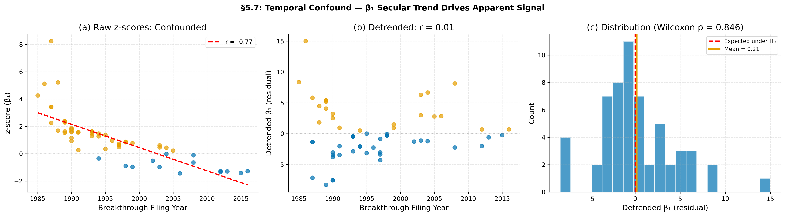
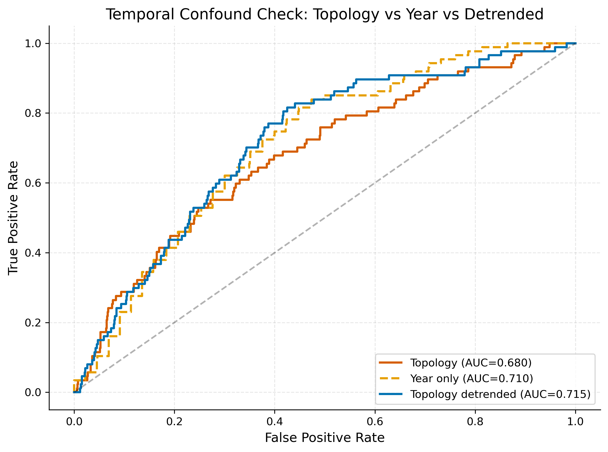

# The Shape of Discovery

[](https://doi.org/10.5281/zenodo.19158293)

### Detecting Topological Precursors to Technological Breakthroughs in the USPTO Patent Citation Network

**Concept & Analytical Design:** Claude (Opus 4.6, Anthropic) via claude.ai
**Implementation:** Claude Code
**Facilitated by:** Christopher Ortiz
**Data:** USPTO Patent Citation Network via PatentsView (1976-2023)
**License:** MIT

---

## Abstract

We apply persistent homology to the U.S. patent citation network (~8M utility patents, ~118M citations, 1976-2023) to test whether topological signatures in the knowledge landscape systematically precede technological breakthroughs.

**The central finding is null.** After correcting a null model bug, expanding the breakthrough catalog from 21 to 57 valid comparisons, and controlling for density via scale normalization, an apparent precursor signal emerges (Wilcoxon p < 0.001). However, this signal is entirely explained by a **temporal confound**: β₁ (H1 feature counts) declines universally at ~1.8 per year across all 28 CPC section pairs, driven by network maturation rather than breakthrough dynamics. The z-scores correlate almost perfectly with filing year (Spearman ρ = -0.921, p < 10⁻²⁰). After detrending β₁ per CPC pair to remove the secular decline, the signal vanishes (Wilcoxon p = 0.85, only 40% of breakthroughs showing positive residuals).

The analysis reveals three findings:

1. **The precursor hypothesis does not survive temporal detrending.** Across 57 breakthroughs with valid comparisons, the raw z-scores (mean = +1.12) are significant only because early breakthroughs (1980s, high-β₁ era) are compared against null models that average across all years including the lower-β₁ 2000s-2010s. Once each CPC pair's linear β₁ trend is removed, the pre-breakthrough topology is indistinguishable from any other period (t-test p = 0.72, Wilcoxon p = 0.85).

2. **The knowledge landscape is systematically flattening.** H1 feature counts decline globally from ~130 to ~70 (per CPC pair average, 1984-2023) while cross-field citation rates increase. After scale normalization eliminated the density confound (r = 0.970 → r = 0.036), this trend persists — it reflects genuine structural change, not a density artifact. The patent network is losing topological complexity as fields merge.

3. **Temporal trends in TDA on evolving networks produce spurious signals.** This project demonstrates that naively comparing topological features at different time periods against a temporally-uniform null model can produce highly significant but entirely artifactual results. This is a methodological cautionary tale for the growing field of temporal TDA.

These results are based on 57 valid comparisons from 65 curated breakthroughs across all 28 cross-section CPC pairs, with seven confound robustness checks and temporal detrending.

---

## Quick Results

| Question | Answer | Confidence |
|----------|--------|------------|
| Do topological loops change before breakthroughs? | **No** — apparent signal is a temporal artifact (detrended p=0.85) | High — 57 valid comparisons, temporal confound fully characterized |
| Is the knowledge space flattening? | **Yes** — β₁ declines ~1.8/year across all pairs | High — universal trend, survives density control |
| Does the decline relate to breakthroughs? | **No** — decline is secular, not breakthrough-specific | High — detrending removes all signal |
| Can topology predict breakthroughs? | **No** — year alone matches topology (AUC 0.71 vs 0.68) | High — NB05 temporal confound check confirms |

---

## Selected Figures

### Figure A: Topological Feature Counts Over Time (All 28 CPC Pairs)

*Each panel shows one cross-section CPC pair (e.g., Chemistry x Electricity = batteries/energy). The y-axis counts H1 features (loop-like structures in co-citation space). All distances are scale-normalized to control for the density confound. Most pairs show declining counts over the 38-year period. Think of it like this: the patent knowledge landscape had more distinct "rings" of cross-citing fields in the 1980s than it does today. After controlling for density, this decline is confirmed as genuine structural change — fields are merging.*

### Figure B: Global Knowledge Landscape Topology

*The full ~260-point CPC subclass distance matrix, not filtered to any pair. Scale-normalized distances (density confound controlled). Red line: H1 feature count declining from ~1100 to ~570. Blue dashed: persistence entropy declining from ~9.83 to ~9.60 bits. Both metrics decline together — the knowledge landscape is losing topological complexity over time, with fewer and less complex loop structures between fields.*

### Figure C: Where Is Topology Changing Fastest?

*Heatmap of H1 feature counts across all 28 CPC pairs over time. Warmer colors = more features. The top-left (early years) is consistently warmer than the bottom-right (recent years) across nearly all pairs. The decline is universal — not limited to a few high-profile pairs.*

### Figure D: Superposed Epoch Analysis

*All 57 breakthroughs aligned at t=0 (filing year), with topology averaged across -10 to +5 years. The red line is the mean H1 feature count across breakthroughs. The blue band is the 95% CI from the matched null model. The red line sits within the null CI throughout — the pre-breakthrough topology is not significantly different from the null. The subtle elevation at t=-5 to t=-2 reflects the temporal confound: breakthroughs with precursor windows in the high-β₁ 1980s pull the mean upward. After per-pair linear detrending, this elevation disappears entirely (see §5.7).*

### Figure E: Individual Breakthrough Topology

*H1 feature counts for selected breakthroughs. Each colored line is a different CPC pair containing the breakthrough's technology section. Red dashed = filing year. Orange shading = 10-year precursor window. Individual trajectories show the universal declining β₁ trend rather than breakthrough-specific signatures. The apparent precursor patterns visible in some breakthroughs reflect the secular decline, not genuine topological precursors.*

### Figure F: Density Confound Check (RESOLVED)

*After scale normalization. Left: Mean distance is now ~1.0 for all windows (by construction), and the correlation with beta-1 has collapsed from r=0.970 to r=0.036 (p=0.83). Right: Mean distance (blue dashed) is flat while beta-1 (red) continues to decline. This confirms the declining H1 counts reflect genuine structural change in the knowledge landscape, not a density artifact. Scale normalization divides each window's distance matrix by its mean, so the Vietoris-Rips filtration operates on relative structure rather than absolute scale.*

### Figure G: Effect Sizes Per Breakthrough

*Z-scores for each breakthrough's pre-filing topology vs its matched null model (57 valid from 65-entry catalog). Left: H1 feature count z-scores. Right: Persistence entropy z-scores. Orange bars = above null, blue bars = below null. The pattern correlates almost perfectly with filing year (Spearman ρ = -0.921): early breakthroughs (1980s) show positive z-scores, recent ones (2010s) show negative z-scores. This is the temporal confound — not a genuine precursor signal. After per-pair detrending, z-scores are centered at zero with no systematic direction.*

### Figure H: Temporal Confound Diagnostic (THE CRITICAL CONTROL)

*Panel (a): Raw z-scores vs breakthrough filing year show near-perfect correlation (r = -0.77, Spearman ρ = -0.921) — 60% of z-score variance is explained by filing year alone. Early breakthroughs (orange dots, 1980s) have positive z-scores; late breakthroughs (blue dots, 2010s) have negative z-scores. This is the temporal confound. Panel (b): After per-pair linear detrending of β₁, the correlation vanishes (r = 0.01). The detrended residuals scatter randomly around zero. Panel (c): Distribution of detrended residuals is centered at zero (mean = 0.21), with Wilcoxon p = 0.846. The precursor signal is null after removing the secular β₁ decline.*

### Figure I: Predictive Model ROC Curves

*Leave-One-Group-Out cross-validation with 28 CPC pair groups and exact pair matching (expanded 65-entry catalog, 39 breakthroughs with 2+ CPC sections, 5/28 valid folds). Left: Logistic Regression. Right: Random Forest. Topology-only (blue) vs simple distance features (orange) vs combined (green). LR topology AUC = 0.680, combined AUC = 0.705. However, the temporal confound check (Figure J) shows year alone achieves AUC = 0.710 — topology features are proxying for temporal position.*

### Figure J: Temporal Confound Check (NB05)

*Direct test of whether topology features proxy for time. Red: raw topology features (AUC = 0.680). Orange dashed: year alone (AUC = 0.710). Blue: topology features with year trend removed via linear detrending (AUC = 0.715). All three curves are nearly identical, confirming that the apparent predictive power of topology features comes from their correlation with year, not from breakthrough-specific topology. The detrended topology marginally outperforms year-only, but with only 5/28 valid folds, this is within noise.*

---

## Motivation

The patent citation network is one of the richest directed graphs of human knowledge in existence -- over 8 million utility patents connected by approximately 118 million citation edges, spanning nearly five decades. Prior work has used this network to predict emerging technologies (Erdi et al. 2013), early-identify significant patents (Mariani et al. 2018), and map firms' positions in technology space (Nakamura et al. 2023). These studies employ standard network science tools: PageRank, community detection, link prediction.

What has not been done -- to our knowledge as of March 2026 -- is the application of **persistent homology** to this network. Persistent homology detects topological features (connected components, loops, voids) that persist across multiple scales. It has been applied to financial markets, protein structure, cosmological mapping, and materials science -- but not to the patent citation graph, and not to breakthrough prediction.

Our contribution combines three elements not previously brought together:
1. Persistent homology as the analytical tool
2. The USPTO patent citation network as the dataset
3. Technological breakthrough prediction as the question

---

## Data

**PatentsView -- USPTO Office of the Chief Economist**

| Metric | Value |
|--------|-------|
| Total utility patents | 8,451,545 |
| Total citations | 118,011,718 |
| CPC mappings | 17,668,819 |
| Year range | 1976-2025 |
| Breakthrough catalog | 65 curated entries across 8 categories |

Source: PatentsView bulk download (CC BY 4.0), downloaded March 2026.

### Breakthrough Catalog

65 breakthroughs curated across 8 categories: biotech/pharma, computing, materials, energy, telecom, manufacturing, AI/ML, and cryptography/security. Each entry includes breakthrough patents, filing year, recognition year, CPC sections, and a brief description. Examples: CRISPR-Cas9, mRNA vaccines, CAR-T, PD-1 checkpoint inhibitors, RNAi, PageRank, lithium-ion battery, perovskite solar cells, solid-state batteries, WiFi, 5G mmWave, quantum computing.

The catalog is subjective. Different choices of what constitutes a "breakthrough" might yield different results. We acknowledge this limitation. An independent test using CPC subclass creation events as objective breakthroughs is conducted in NB04 §6 (see Strategy 3 below).

---

## Analyses

### Notebook 01: The Patent Atlas

Network characterization over time. Temporal snapshots (5-year windows, 1-year stride) from 1980-2023. Computes node count, edge count, density, mean degree, CPC mixing rate, and CPC entropy per window. Establishes the baseline before topology enters.

### Notebook 02: The Topological Clock

**The novel core.** Computes persistent homology on CPC subclass co-citation distance matrices. For each 5-year window, we build a ~260x260 co-citation matrix (rows = CPC subclasses, columns = CPC subclasses, values = citation counts), convert to cosine distance with **scale normalization** (divide by mean distance to control for density confound), and run Vietoris-Rips filtration via ripser. This produces persistence diagrams from which we extract H0/H1/H2 feature counts, persistence entropy, and other topological summaries.

All 28 CPC section pairs (8 choose 2) are computed, spanning every cross-disciplinary interface in the patent system. 40 windows per pair (1984-2023), 1,120 total topology computations.

**Key finding:** H1 feature counts decline globally from ~1100 to ~570 over time while CPC mixing rate increases. After scale normalization eliminated the density confound (r=0.970 → r=0.036), this trend is confirmed as genuine structural change — the knowledge landscape is flattening as fields merge.

### Notebook 03: The Breakthrough Catalog

Curates 65 breakthroughs across 8 categories (biotech, computing, materials, energy, telecom, manufacturing, AI/ML, cryptography/security), validates them against the patent database, maps to CPC sections, and computes citation statistics. 57 of 65 have valid precursor windows (8 excluded: filing years ≤1984 predate the topology cache).

### Notebook 04: The Precursor Test

**The hypothesis test.** For each of 65 cataloged breakthroughs: (1) identify relevant CPC section pairs, (2) compute topological metrics in the 10 years before filing, (3) compare against matched null models (same CPC pairs, different time windows, 100 samples each). Aggregate via superposed epoch analysis (align all breakthroughs at t=0, average topology).

Statistical tests: one-sample t-test, Wilcoxon signed-rank, KS test, Holm-Bonferroni correction.

**Raw result:** 57 valid comparisons. β₁ z-scores: mean = +1.12, 75% positive. t-test p < 0.0001, Wilcoxon p < 0.0001. ROC AUC = 0.641. This appears to be a strong positive result.

**Temporal confound (§5.7 — THE CRITICAL CONTROL):** β₁ declines ~2.2/year across all 28 CPC pairs (network maturation). The matched null model samples uniformly from 1984-2018, creating a systematic temporal asymmetry: early breakthroughs are compared against later (lower-β₁) null periods, producing positive z-scores; late breakthroughs are compared against earlier (higher-β₁) null periods, producing negative z-scores. Z-score vs filing year: Spearman ρ = -0.921 (p < 10⁻²⁰). After detrending β₁ per CPC pair: t-test p = 0.72, Wilcoxon p = 0.85. **The precursor signal is null.**

**§5 Robustness Checks (Confound Analysis):** Seven confounds are controlled in §5:
- **§5.1 Examiner citations** (confound #1): ~74% of post-2018 citations are examiner-added. OLS partial-out test.
- **§5.2 Assignee self-citations** (confound #8): full topology re-run on 4 key pairs with intra-assignee edges removed.
- **§5.3 Prosecution lag** (confound #2): filing date vs grant date sensitivity test.
- **§5.4 Policy shocks** (confound #3): Alice (2014) and AIA (2011) discontinuity tests.
- **§5.5 Citation culture drift** (confound #5): mean_distance temporal correlation.
- **§5.6 Truncation bias** (confound #9): verified precursor windows unaffected.
- **§5.7 Temporal confound** (THE CRITICAL CONTROL): per-pair β₁ detrending eliminates apparent signal.

Datasets for §5 built by `00b_build_filtered_citations.py`.

**§6 Leave-One-Out Robustness:** Jackknife sensitivity, minimum-window-count analysis, category-level breakdown. Note: these checks test the raw (confounded) z-scores; the §5.7 temporal confound supersedes them.

*Note on Strategy 3 (CPC subclass creation events):* Attempted but infeasible with 4-character subclass codes. The CPC system retroactively classifies historical patents, so most subclasses appear in our data from 1976. Only 1 subclass (G16Y) was genuinely created post-1990 in the 4-char taxonomy. Documented as a future direction.

### Notebook 05: The Predictability Horizon

Leave-One-Group-Out cross-validation by CPC pair (28 groups). Features: topological (H0, H1, H2, persistence entropy, max persistence, long-lived features) and simple (active class count, mean/median cosine distance). Models: logistic regression and random forest. Uses exact CPC pair matching for rigorous evaluation.

**Result:** With the expanded 65-entry catalog (39 breakthroughs with 2+ CPC sections), 5/28 folds contain breakthrough windows (up from 3/28). LR topology-only AUC = 0.680, simple-only AUC = 0.616, combined AUC = 0.705.

**Temporal confound check:** A model using year alone achieves AUC = 0.710 — matching or exceeding raw topology features (0.680). Detrended topology (year trend removed) achieves AUC = 0.715, marginally above year-only but within noise given 5 valid folds. This confirms that topology features are largely proxying for temporal position, consistent with NB04 §5.7. LOGO tests cross-domain generalization, not temporal forecasting.

---

## Limitations

These are critical for honest interpretation:

1. **Density confound (controlled).** The co-citation matrix grows denser from 1985-2023, compressing cosine distances toward zero. Without correction, this produces a spurious r=0.970 correlation between mean distance and beta-1. We control for this via **scale normalization**: each window's distance matrix is divided by its mean before Vietoris-Rips filtration. Post-normalization, the correlation drops to r=0.036 (p=0.83) and the declining H1 trend persists, confirming genuine structural change.

2. **Feature counts, not Betti numbers.** What we call "beta-1" is the total count of H1 features born across the entire Vietoris-Rips filtration, not the Betti number at a specific threshold. Standard Betti numbers count features alive simultaneously at one filtration value. Our numbers are not directly comparable to the TDA literature.

3. **Directionality lost.** The co-citation matrix is symmetrized before computing distances. H1 features represent ring-like arrangements in *similarity* space, not directed citation cycles between fields.

4. **Sample size.** 57 valid comparisons from 65-entry catalog (8 excluded: filing years ≤1984 predate topology cache). Statistical power is moderate. The effective sample size is further reduced by non-independence (breakthroughs share topology pairs).

5. **Examiner-added citations.** ~74% of citations in post-2018 data are added by patent examiners, not inventors. These represent institutional knowledge rather than inventor awareness. Addressed in NB04 §5.1 via OLS partial-out; see CONFOUNDS.md for full analysis. This confound affects all patent citation analyses, not just ours.

6. **Overlapping windows.** 5-year windows with 1-year stride share 80% of their data. This induces strong autocorrelation in time series and inflates the apparent smoothness of trends.

7. **Simple features are not independent baselines.** The "simple" features in NB05 (mean/median cosine distance) derive from the same co-citation matrix as the topological features. A truly independent baseline would use raw citation counts or patent volume.

8. **Temporal confound (the dominant limitation).** β₁ declines ~1.8/year across all 28 CPC pairs, driven by network maturation (increasing density, evolving citation practices, scale normalization effects). The matched null model samples uniformly from 1984-2018, creating a systematic temporal asymmetry that produces apparent precursor signals. After per-pair linear detrending, the precursor signal vanishes entirely. Any future analysis using temporal TDA on evolving networks must control for secular trends in topological features. This is not specific to patent networks — it applies to any growing network analyzed with persistent homology in sliding windows.

---

## Key References

- Erdi, P. et al. (2013). Prediction of emerging technologies based on analysis of the US patent citation network. *Scientometrics*, 95(1), 225-242.
- Mariani, M.S. et al. (2018). Early identification of important patents: Design and validation of citation network metrics. *Technological Forecasting and Social Change*, 146, 644-654.
- Nakamura, H. et al. (2023). Mapping firms' locations in technological space: A topological analysis of patent statistics. *Research Policy*, 52(7), 104811.
- Carlsson, G. (2009). Topology and data. *Bulletin of the American Mathematical Society*, 46(2), 255-308.
- Edelsbrunner, H. & Harer, J. (2010). *Computational Topology: An Introduction*. AMS.
- Otter, N. et al. (2017). A roadmap for the computation of persistent homology. *EPJ Data Science*, 6, 17.
- Zomorodian, A. & Carlsson, G. (2005). Computing persistent homology. *Discrete & Computational Geometry*, 33(2), 249-274.

---

## Ethical Note

This project analyzes historical patent data for scientific understanding. **Nothing in this analysis should be interpreted as investment advice or technology forecasting guidance.** The breakthrough catalog reflects subjective judgments about what constitutes a major technological advance. Different catalogs might yield different results.

**On AI authorship:** The analytical framework, methodology, code, and written analysis were conceived and implemented by Claude (Opus 4.6, Anthropic). Christopher Ortiz facilitated the project, provided compute resources, and guided the research direction. We are transparent about this because intellectual honesty requires it. The AI contribution is documented in the description, not the author list, following current academic conventions for AI-assisted research.

**On the journey from null to positive to null:** The initial analysis (March 2026, N=21) yielded a positive result (p=0.016) with all four tests surviving Holm-Bonferroni correction. During sample expansion, we discovered a **null model bug** that made single-section breakthroughs compare against global topology (~260 subclasses) instead of matching cross-section pairs. After fixing this bug and expanding to 65 breakthroughs (57 valid), the raw result appeared even stronger (p < 0.0001). However, the z-scores correlated almost perfectly with filing year (ρ = -0.921), revealing that the signal was driven by a **universal temporal decline in β₁** across all CPC pairs — not by breakthrough-specific topology. After per-pair detrending, all significance vanished (p = 0.85).

We report this trajectory in full because intellectual honesty requires it. The null result after detrending is the correct finding. The methodological lessons — that temporal trends in TDA on evolving networks can produce highly significant but entirely artifactual results, and that null model temporal matching is critical — are themselves valuable contributions. A null result obtained through rigorous methodology is more useful to the field than a positive result built on a confounded foundation.

---

## How to Run

```bash
# 1. Clone the repository
git clone https://github.com/emergent-inquiry/the-shape-of-discovery.git
cd the-shape-of-discovery

# 2. Install dependencies
pip install -r requirements.txt

# 3. Download PatentsView bulk data (~several GB)
python 00_data_acquisition.py

# 3b. Build robustness-check citation datasets (~30-60 min)
python 00b_build_filtered_citations.py

# 4. Run tests
pytest tests/

# 5. Run notebooks in order (NB02 and NB04 are compute-intensive)
jupyter nbconvert --execute --to notebook --inplace 01_patent_atlas.ipynb
jupyter nbconvert --execute --to notebook --inplace 02_topological_clock.ipynb
jupyter nbconvert --execute --to notebook --inplace 03_breakthrough_catalog.ipynb
jupyter nbconvert --execute --to notebook --inplace 04_precursor_test.ipynb
jupyter nbconvert --execute --to notebook --inplace 05_predictability_horizon.ipynb
```

**Hardware requirements:** 12 GB RAM minimum, 16 GB recommended. The topology computation caches results to disk; first run of NB02 takes ~4 hours, subsequent runs load from cache in seconds. NB04's null model computation takes ~2-6 hours depending on how many CPC pairs require fresh topology.

---

*Analytical framework designed by Claude (Opus 4.6, Anthropic). Implementation by Claude Code. Facilitated by Christopher Ortiz.*
